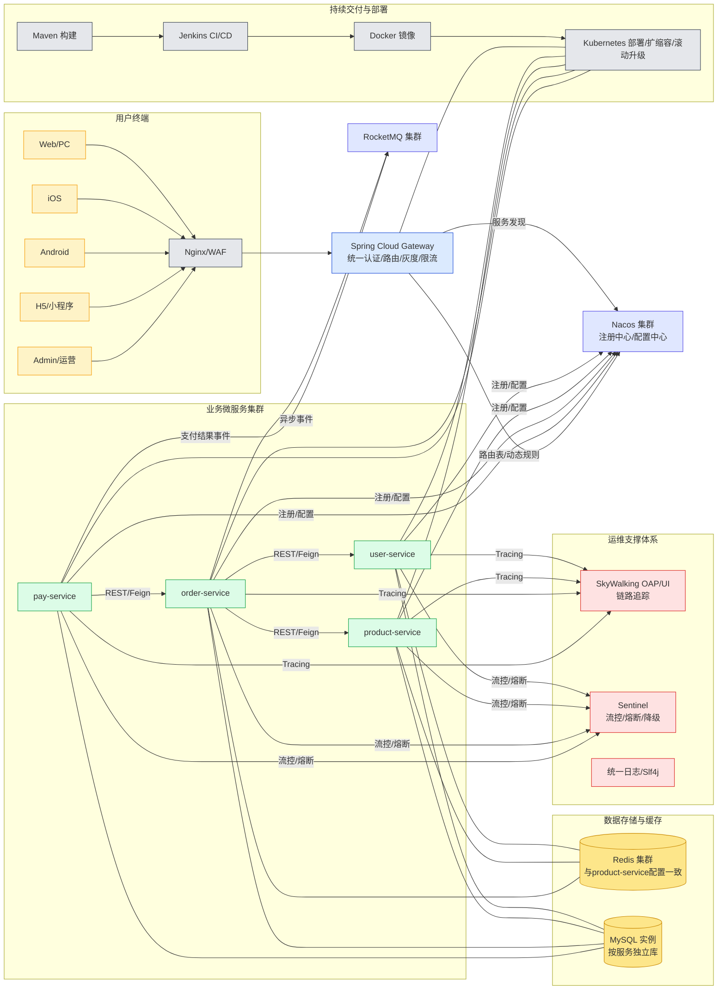
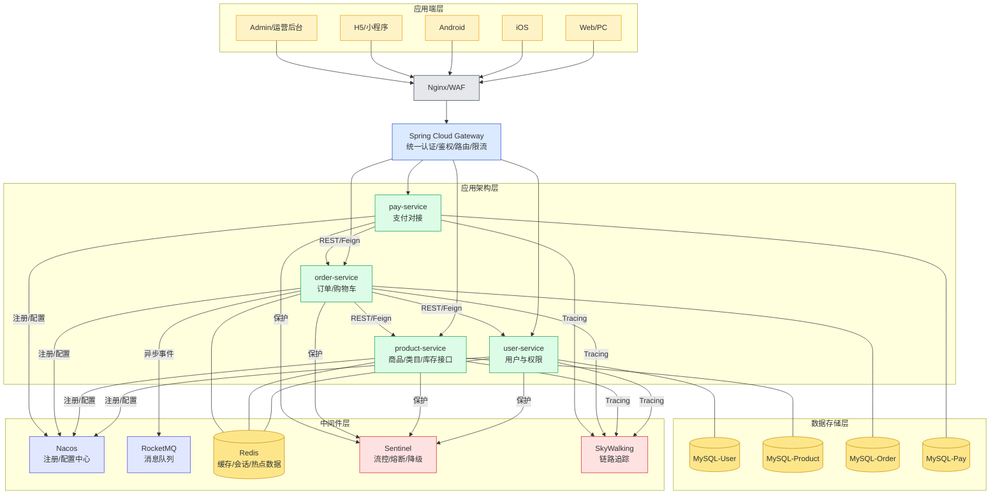

# Sunshine Mall 架构图（技术栈与系统应用分层）

说明：本文件提供两套统一风格的架构图，采用 Mermaid 绘制，便于在 IDE/Markdown 预览中直接查看与维护。遵循项目工作区规则：全中文表达、避免过度设计、暂不考虑物流/AI服务的实现细节、风格与 product-service 保持一致、Redis 配置与 product-service 一致、依赖注入采用构造函数注入。

目录：
- 一、微服务架构技术栈图（组件与关系、通信机制、运维体系）
- 二、系统应用架构图（分层设计、关键技术选型、高可用与安全）
- 三、设计要点与架构优势
- 四、查看与维护建议

---

## 一、微服务架构技术栈图



要点：
- 服务注册与发现、配置中心：Nacos（集群），网关与微服务统一从 Nacos 拉取配置、参与注册。
- 服务通信机制：内部同步走 REST + OpenFeign；异步使用 RocketMQ；暂不使用 gRPC（如需可扩展）。
- 运维支撑：SkyWalking 链路追踪，Sentinel 流控/熔断，统一日志；满足观测与稳定性要求。
- 缓存与数据：Redis 与 product-service 配置一致；MySQL 按服务独立库，后续可演进主从与分库分表。
- 交付与部署：Maven 构建、Jenkins流水线、Docker 镜像、Kubernetes 部署（多副本、滚动升级、弹性扩缩容）。

---

## 二、系统应用架构图（分层）



关键技术选型与设计：
- 网关：Spring Cloud Gateway（统一认证在网关，服务内去除JWT），支持灰度、限流与黑白名单。
- 注册/配置：Nacos 集群，统一配置下发（如 Redis 连接、DB 连接等），服务按构造函数注入依赖。
- 通信机制：REST + OpenFeign 为主；RocketMQ 作为异步事件通道；暂不使用 gRPC。
- 缓存：Redis（与 product-service 配置一致），作为热点数据与会话存储；支持穿透/雪崩/击穿防护（参考 product-service 缓存策略）。
- 数据：MySQL 按服务独立库；可平滑演进主从、读写分离与分库分表（不做过度设计）。
- 稳定性：Sentinel（流控/熔断/降级）；幂等（使用 idempotent 框架）；统一日志与链路追踪（SkyWalking）。
- 部署与运维：Jenkins + Maven 构建，Docker 镜像，Kubernetes 部署；多副本、滚动升级、健康检查与自动重启。
- 安全防护：Nginx/WAF 前置；网关鉴权、参数校验与限流；内部服务最小权限与接口黑白名单；敏感数据脱敏日志。

---

## 三、设计要点与架构优势
- 一致的技术栈：Spring Boot + Spring Cloud（Gateway、OpenFeign、Nacos）+ Redis + RocketMQ + MySQL + SkyWalking + Sentinel。
- 清晰的服务边界：user/product/order/pay 独立自治，网关统一入口，降低耦合。
- 可靠的通信与事件驱动：同步 REST 保证简单直观；异步 MQ 保证解耦与削峰。
- 可观测与稳定性：SkyWalking 端到端追踪、统一日志；Sentinel 的限流熔断，结合幂等与重试策略提升韧性。
- 持续交付与弹性扩展：Jenkins 流水线、Docker 化、K8s 部署，多副本与滚动升级确保高可用。
- 简洁而不失扩展：当前不引入 gRPC/复杂分库；保留演进空间，避免过度设计。

---

## 四、查看与维护建议
- 在 VS Code/IntelliJ 安装 Mermaid 插件或开启 Markdown 预览，即可渲染本图。
- 如需扩展到更多微服务（如物流/AI），建议以“可选层”或“预留节点”标注，避免影响当前实现与测试。
- Redis、Nacos、RocketMQ、MySQL 的集群地址与参数统一由 Nacos 配置中心管理，保持与 product-service 的风格与配置一致。
- 文档与代码演进时，优先复用已完成组件与通用框架（convention、idempotent、cache、database等），减少重复造轮子。
```