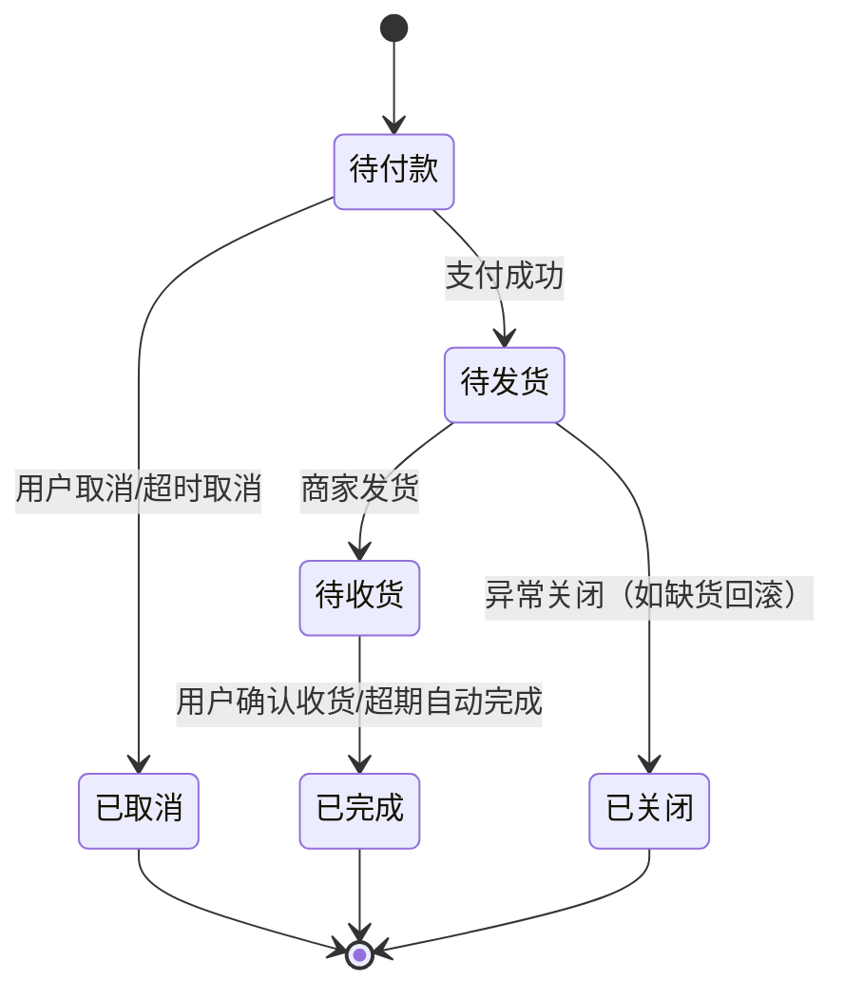
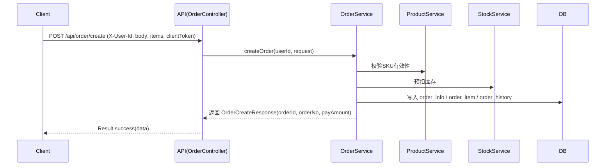
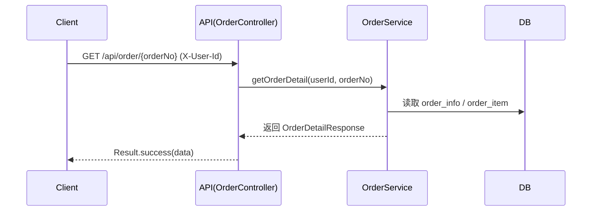
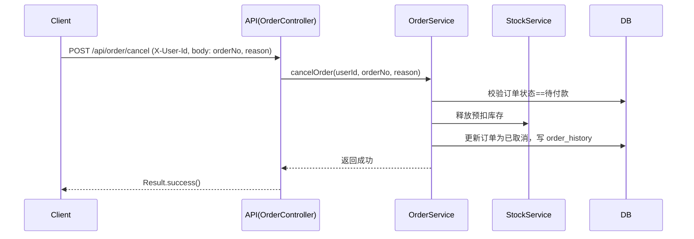
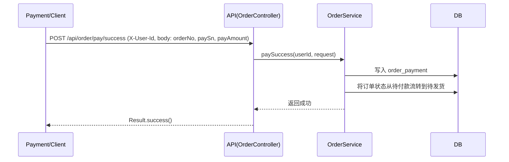
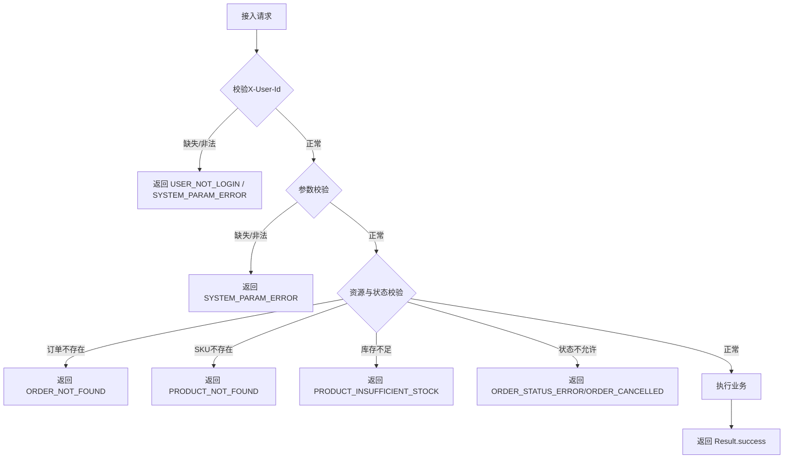
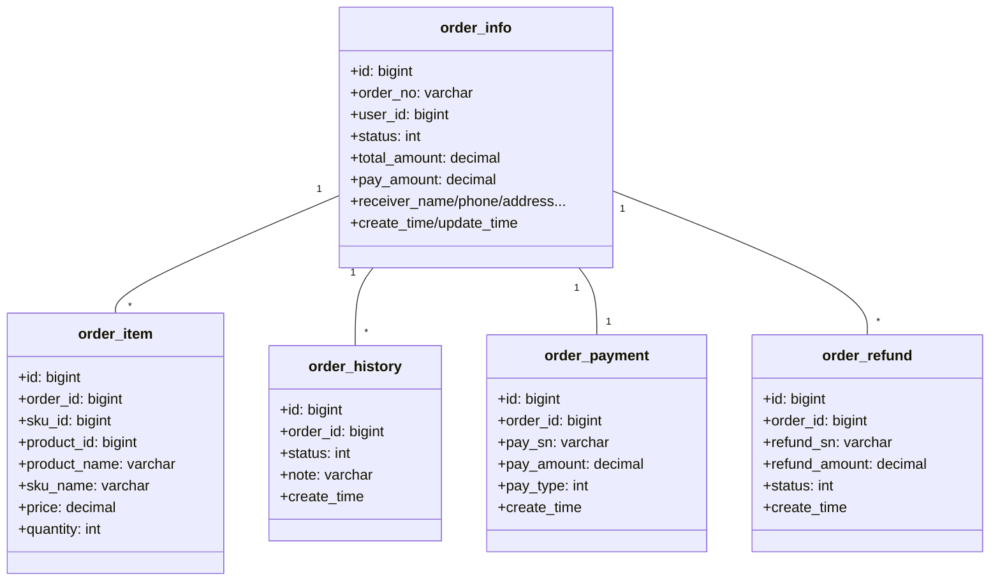

# 订单模块业务流程文档

本文档描述 sunshine-mall 的订单模块业务流程与接口时序，涵盖订单生命周期、状态转换条件、异常处理以及核心数据模型。为避免过度设计，
仅围绕当前 order-service 的能力展开，暂不考虑物流服务与 AI 服务的实现细节。

## 1. 文档概览
- 模块：order-service
- 接口前缀：/api/order
- 认证要求：Header 携带 X-User-Id（数值型），否则返回 USER_NOT_LOGIN
- 统一响应：Result { code, message, data }

## 2. 订单生命周期流程图
使用 Mermaid 描述状态机（可在支持 Mermaid 的 Markdown 预览中查看）。

对应枚举（示例，具体以代码为准）：
- 0 待付款（WAIT_FOR_PAY）
- 1 待发货（WAIT_FOR_DELIVERY）
- 2 待收货（WAIT_FOR_RECEIVE）
- 3 已完成（COMPLETED）
- 4 已关闭（CLOSED）
- 5 已取消（CANCELLED）

## 3. 状态转换条件与业务规则
- 创建订单：生成订单号，初始状态为 待付款。
- 支付成功：仅待付款订单允许支付确认；成功后状态流转为 待发货，并写入支付记录（order_payment）。
- 用户取消：仅待付款订单允许取消；取消后状态为 已取消，并记录订单历史（order_history）。
- 商家发货：待发货 -> 待收货（当前未提供发货接口，流程规则留存）。
- 用户确认收货：待收货 -> 已完成（当前未提供确认接口，流程规则留存）。
- 异常关闭：在库存异常或风控场景下可关闭订单为 已关闭（流程规则留存）。

注意：为保证简洁，当前控制器仅暴露创建、取消、详情查询与支付成功接口；发货、确认收货由后续迭代提供。

## 4. 相关API接口与调用时序

### 4.1 创建订单
接口：POST /api/order/create

关键规则：
- 必填：items、每个 item.skuId 与数量（quantity >= 1）；clientToken用于幂等。
- 异常：SKU不存在、库存不足、参数缺失/格式错误、未登录。

### 4.2 查询订单详情
接口：GET /api/order/{orderNo}

### 4.3 取消订单
接口：POST /api/order/cancel

### 4.4 支付成功通知
接口：POST /api/order/pay/success

## 5. 异常处理流程与边界条件

常见错误码（示例，具体以 BusinessErrorCode 实现为准）：
- USER_NOT_LOGIN：未携带有效用户身份
- SYSTEM_PARAM_ERROR：参数缺失或格式错误
- ORDER_NOT_FOUND：订单不存在
- ORDER_STATUS_ERROR：订单状态不允许该操作
- ORDER_CANCELLED：订单已取消
- PRODUCT_NOT_FOUND：商品或SKU不存在
- PRODUCT_INSUFFICIENT_STOCK：库存不足
- PAYMENT_FAILED：支付失败或金额不匹配（如有）

返回体结构：
- 成功：`{"code":"0","message":"操作成功","data":{...}}`
- 失败：`{"code":"<ERROR_CODE>","message":"<错误信息>","data":null}`

## 6. 业务数据模型与关键字段

### 6.1 表关系

### 6.2 关键字段定义
- order_info.order_no：订单唯一编号，字符串（如 ORD202501010001）
- order_info.status：订单状态枚举（见第2节），整型
- order_info.pay_amount：需支付金额（优惠后）
- order_item.price：SKU成交单价；order_item.quantity：购买数量
- order_payment.pay_sn：支付流水号；pay_amount：实际支付金额
- order_history.note：状态流转或重要事件记录

## 7. 测试数据与联调说明
- SQL：在 resources/sql/order_service_schema.sql 已提供插入样例，覆盖待付款、待发货、已完成、已取消、已关闭等状态。
- API：在 resources/api 文件内已提供可直接使用的 YAML 测试用例；按注释设置 baseUrl 与 X-User-Id 后即可执行。
- 依赖：若商品或库存服务未启动或未联通，部分校验将返回 PRODUCT_NOT_FOUND / SYSTEM_BUSY。

## 8. 使用建议
- Postman：导入单条 YAML 用例为 JSON Body 执行；或复制到 REST Client（VS Code 插件）中使用。
- 幂等：创建订单时务必提供 clientToken，避免重复扣减库存。
- 日志：关注 order_history 以审计状态流转。